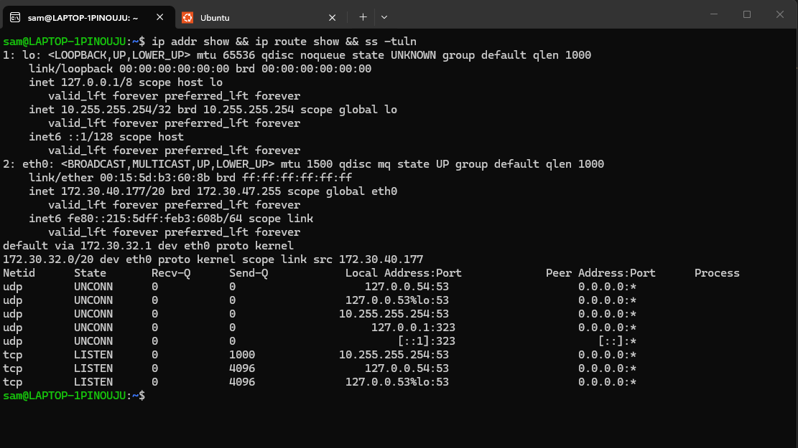
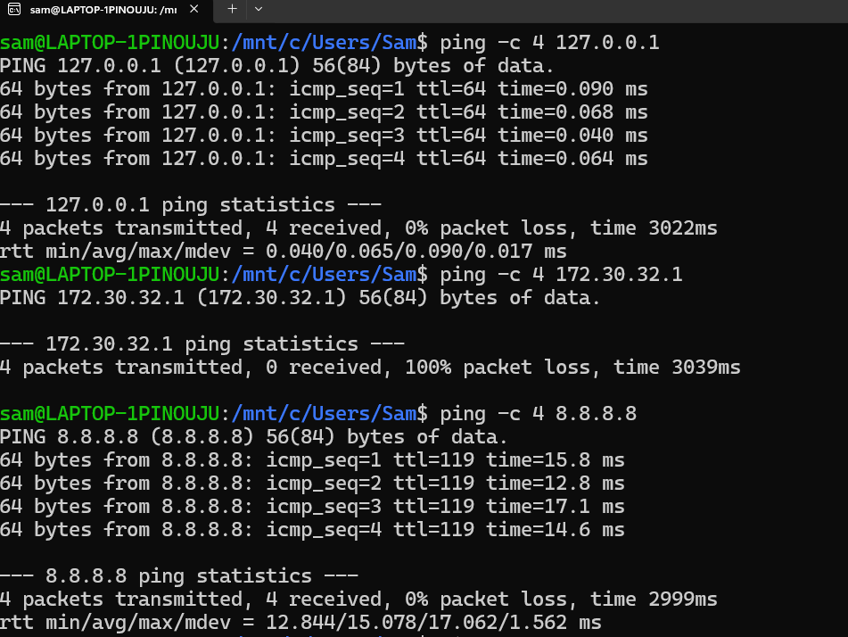
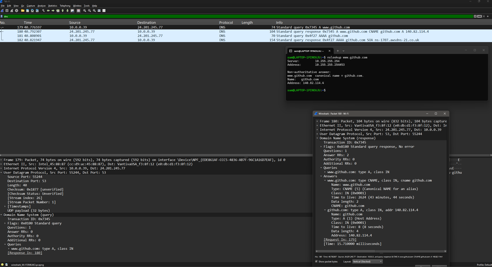
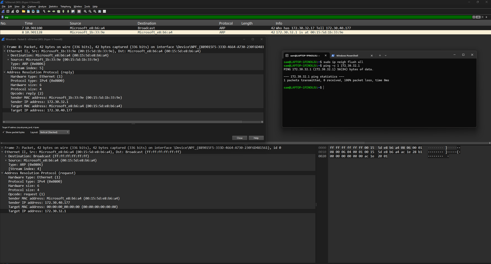

# Laboratoire 2 - Introduction aux Réseaux
## Systèmes d'exploitation - Collège de Maisonneuve

---

**Nom :** Lortie

**Prénom :** Samuel 

**Groupe :** _____________________

**Lien GitHub du devoir** : _____________________

**Date de remise :** Jeudi 13 février 2026
---

## Barème récapitulatif

| Section | Points | Note |
|---------|--------|------|
| Partie 1 : Questions théoriques | 20 | /20 |
| Partie 2 : Commandes réseau | 25 | /25 |
| Partie 3 : Analyse Wireshark | 25 | /25 |
| Partie 4 : Script Bash | 30 | /30 |
| **TOTAL** | **100** | **/100** |

---

# Partie 1 : Questions théoriques (20 points)

## Question 1 - Modèle OSI (5 points)

### a) Complétez le tableau (2.5 pts)

| Protocole/Élément | N° Couche | Nom de la couche |
|-------------------|-----------|------------------|
| HTTP              |     7     |    Application   |
| Adresse IP        |     3     |    Réseau        |
| Câble Ethernet    |     1     |    Physique      |
| TCP               |     4     |    Transport     |
| Adresse MAC       |     2     |    Liaison       |

### b) Différence entre le modèle OSI et TCP/IP (2.5 pts)

```
Votre réponse :

Le modele TCP/IP simplifie le modele OSI en combinant les couches  OSI application,presentation et session en une seul couche TCP/IP application, et OSI liaison, physique en une seule couche TCP/IP acces reseau, donc un total de 4 TCP/IP vs 7 OSI,plus pratique,plus flexible.TCp/IP est le modele standard d'internet.
```

---

## Question 2 - Adresses IP (5 points)

### a) Adresses privées ou publiques (2.5 pts)

| Adresse IP | Privée / Publique |
|------------|-------------------|
| 192.168.1.50     | Privée |
| 8.8.8.8         | Publique |
| 10.0.0.1         | Privée |
| 172.20.5.100     | Privée |
| 200.100.50.25   | Publique |

### b) Qu'est-ce qu'un masque de sous-réseau ? À quoi sert-il ? (2.5 pts)

```
Votre réponse :

La subdivision d'un IP pour que 24 bits soit alouer au reseau et 8 bites a l'hote, qui sert a identifier ces deux sections pour faciliter la comunication entre les reseaux
```

---

## Question 3 - Protocoles (10 points)

### a) Expliquez le fonctionnement du protocole ARP. Pourquoi est-il nécessaire ? (3 pts)

```
Votre réponse :

Le protocole envoie une requete "broadcast" a tout les appareil du reseau pour trouver l'adresse mac inconnue lier a l'ip correspondant a la requete, l'enregistre, et permet donc d'etablir une trame ethernet pour la communication des appareils
```

### b) Différence entre une requête DNS de type A et de type AAAA ? (2 pts)

```
Votre réponse :

Une requete DNS de type A traduit le nom du domaine et repond en IPV4(4 octets), et une requete DNS de type AAAA en IPV6(16 octets)
```

### c) Expliquez ce que fait la commande `ping` au niveau du protocole ICMP. Quels types de messages sont échangés ? (3 pts)

```
Votre réponse :

la commande envoie des message de controle et d'erreur sous forme de requetes (echo request) vers l'ip  et l'appareil avec l'ip corespondant repond (echo reply), puis notre appareil nous informe si la connexion est disponible, si on as perdu des packets et le temp aller-retour
```

### d) Sur quel port et avec quel protocole de transport fonctionne DNS par défaut ? Pourquoi ce choix ? (2 pts)

```
Votre réponse :

Principalement le port 53 parce qu'il fait partit des port bien connus et est reserver pour le dns et le protocole udp parce qu'il est le plus rapide, bien qu'il est non-fiable.
```

---

# Partie 2 : Commandes réseau (25 points)

## Exercice 1 : Configuration réseau (10 points)

### a) Configuration réseau

**Commande utilisée :**
```bash
ip addr show

```

**Adresse IP :**
```
172.30.40.177
```

**Masque de sous-réseau :**
```
/20
```

**Nom de l'interface réseau principale :**
```
eth0
```

### b) Passerelle par défaut

**Commande utilisée :**
```bash
ip route show
```

**Adresse de la passerelle :**
```
172.30.32.1
```

### c) Serveurs DNS

**Commande utilisée :**
```bash
 ss -tuln
```

**Serveurs DNS configurés :**
```
udp             127.0.0.54:53                
udp             127.0.0.53%lo:53        
udp             10.255.255.254:53          
tcp             127.0.0.53%lo:53         
tcp             10.255.255.254:53                
tcp             127.0.0.54:53                 
```

> 📸 **Capture d'écran 1** : Insérez votre capture montrant la configuration réseau
> 
>

---

## Exercice 2 : Tests de connectivité avec ping (8 points)

### a) Ping vers localhost (127.0.0.1) - 4 paquets

**Commande exacte utilisée :**
```bash
ping -c 4 127.0.0.1
```

**Résultat (succès/échec) :**
```
succes(4 paquets transmis,4 recu, 0% perdu)
```

**Temps moyen de réponse :**
```
0.099 miliseconde
```

### b) Ping vers la passerelle - 4 paquets

**Résultat (succès/échec) :**
```
echec(4 paquets transmis,0 recu, 100% perdu)
```

**Temps moyen de réponse :**
```
pas de rtt
```

### c) Ping vers 8.8.8.8 - 4 paquets

**Résultat (succès/échec) :**
```
succes(4 paquets transmis,4 recu, 0% perdu)
```

**Temps moyen de réponse :**
```
15.078 ms
```

### d) Si le ping vers 8.8.8.8 fonctionne mais pas vers google.com, quel serait le problème probable ?

```
Votre réponse :

Le protocole DNS n'a possiblement pas pu faire l'echange pour traduire le nom de domaine en ip
```

> 📸 **Capture d'écran 2** : Insérez votre capture des tests ping
> 
> >

---

## Exercice 3 : Table ARP et résolution DNS (7 points)

### a) Table ARP

**Commande utilisée :**
```bash
arp -a # ou ip neigh show
```

**Nombre d'entrées :**
```
1
```

**Une entrée (IP et MAC) :**
```
(172.30.32.1) at 00:15:5d:1b:33:9e
```

### b) Requête DNS pour www.cmaisonneuve.qc.ca

**Commande utilisée :**
```bash
nslookup www.cmaisonneuve.qc.ca #ou dig www.cmaisonneuve.qc.ca
```

**Adresse IP obtenue :**
```
10.255.255.254
```

### c) Commande `dig` pour github.com - TTL

**TTL (Time To Live) de l'enregistrement :**
```
38
```

> 📸 **Capture d'écran 3** : Insérez votre capture de la table ARP et d'une requête DNS
> 
> >

---

# Partie 3 : Analyse Wireshark (25 points)

## Exercice 4 : Capture et analyse ICMP (10 points)

### Analyse d'un paquet "Echo (ping) request"

| Information | Valeur observée |
|-------------|-----------------|
| Adresse MAC source | cc:d9:ac:45:88:87 |
| Adresse MAC destination | e0:db:d1:f3:8f:12 |
| Adresse IP source | 10.0.0.39 |
| Adresse IP destination | 8.8.8.8 |
| Type ICMP (numéro) | 8 |
| Code ICMP | 0 |

### Question : Différence entre le Type ICMP d'un "Echo Request" et d'un "Echo Reply" ?

```
Votre réponse :

le echo request a un type 8 alors que le echo reply a un type 0
```

> 📸 **Capture d'écran 4** : Capture Wireshark montrant les paquets ICMP avec le détail d'un paquet
> 
> 

---

## Exercice 5 : Capture et analyse DNS (8 points)

### Analyse de la requête et réponse DNS

| Information | Valeur observée |
|-------------|-----------------|
| Port source (requête) | 55244 |
| Port destination (requête) | 53 |
| Protocole de transport | UDP |
| Type de requête DNS | type A |
| Adresse IP dans la réponse | 140.82.114.4|

> 📸 **Capture d'écran 5** : Capture Wireshark montrant la requête et réponse DNS
> 
> 

---

## Exercice 6 : Capture et analyse ARP (7 points)

### Tableau d'un échange ARP observé

| Information | ARP Request | ARP Reply |
|-------------|-------------|-----------|
| Adresse MAC source | 00:15:5d:e8:b6:a4|  00:15:5d:1b:33:9e  |
| Adresse MAC destination | ff:ff:ff:ff:ff:ff | 00:15:5d:e8:b6:a4|
| Adresse IP recherchée |  172.30.32.1 | 172.30.40.177|

### Question : Pourquoi l'adresse MAC de destination dans l'ARP Request est-elle `ff:ff:ff:ff:ff:ff` ?

```
Votre réponse :

car la requete ARP est envoyer en broadcast a tout les appareil associer l'ip connue a l'adresse mac inconnue,ensuite l'appareil qui a cet ip seras le seul qui repond avec l'adrese mac
```

> 📸 **Capture d'écran 6** : Capture Wireshark montrant l'échange ARP
> 
> 

---

# Partie 4 : Script de diagnostic réseau (30 points)

## Exercice 7 : Création du script

### Informations sur votre script

**Nom du fichier :** `diagnostic_reseau.sh`

### Checklist des fonctionnalités implémentées

Cochez les fonctionnalités que vous avez implémentées :

- [ ] Affichage du nom de l'hôte
- [ ] Affichage de la date et heure
- [ ] Affichage de la version du système
- [ ] Affichage de l'adresse IP locale
- [ ] Affichage de l'adresse de la passerelle
- [ ] Affichage des serveurs DNS
- [ ] Test de connectivité localhost
- [ ] Test de connectivité passerelle
- [ ] Test de connectivité Internet (8.8.8.8)
- [ ] Test de résolution DNS (google.com)
- [ ] Affichage de la table ARP
- [ ] Résolution DNS de 2+ domaines
- [ ] Gestion des erreurs (messages si échec)
- [ ] Commentaires dans le code
- [ ] Affichage clair avec titres de sections

### Difficultés rencontrées (optionnel)

```
Décrivez ici les difficultés que vous avez rencontrées lors de la création du script :


```

> 📸 **Capture d'écran 7** : Capture montrant l'exécution de votre script
> 
> 

---

# Récapitulatif de la remise

## Fichiers à inclure dans votre projet

Vérifiez que votre projet contient :

- [ ] `reponse.md` (ce fichier complété)
- [ ] `diagnostic_reseau.sh` (votre script)
- [ ] `captures/capture1_config_reseau.png`
- [ ] `captures/capture2_ping.png`
- [ ] `captures/capture3_arp_dns.png`
- [ ] `captures/capture4_wireshark_icmp.png`
- [ ] `captures/capture5_wireshark_dns.png`
- [ ] `captures/capture6_wireshark_arp.png`
- [ ] `captures/capture7_script_execution.png`

---


---

*Bon travail !*